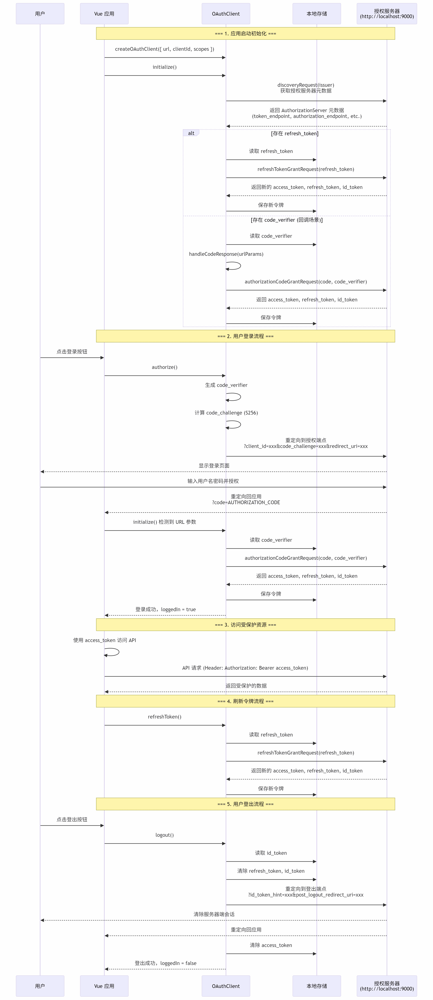

Protect a Vue application with Spring Authorization Server.

The complete code is available in the example project [https://github.com/qihaiyan/ng-boot-oauth](https://github.com/qihaiyan/ng-boot-oauth)

 

 When running the example code, start `authserver` first, then start `ui-spa-vue`.

## 1. Overview

There are already plenty of articles about protecting Vue applications with OAuth, but examples integrating with Spring Authorization Server are relatively rare, and many of them are still Vue 2 code. This post focuses on how to integrate Vue 3 with Spring Authorization Server, with a working example.

## 2. Core Interaction Flow

This diagram shows the complete OAuth 2.0 + OpenID Connect authorization code flow, including key steps such as application initialization, user login, token management, and logout.

 

### 1. Initialization flow (main.ts:17)
- Create an OAuthClient instance and configure its parameters
- Call initialize() to perform service discovery
- Automatically handle token refresh or the authorization code callback
### 2. Authorization code flow (OAuthClient.ts:240)
- Use PKCE (Proof Key for Code Exchange) for enhanced security
- Generate code_verifier and code_challenge
- Redirect to the authorization server to obtain an authorization code
- Exchange the authorization code for an access token
### 3. Token storage (OAuthClient.ts:130-145)
- access_token : token for accessing protected resources
- refresh_token : used to refresh the access token
- id_token : OpenID Connect identity token
- code_verifier : PKCE verifier
### 4. Logout flow (OAuthClient.ts:369)
- Clear locally stored tokens
- Notify the authorization server with the id_token_hint parameter
- Redirect to the authorization server's logout endpoint
### 5. Security features
- ✅ PKCE (S256) prevents authorization code interception attacks
- ✅ HTTPS enforced (can be bypassed via allowInsecureRequests in development)
- ✅ Automatic token refresh mechanism
- ✅ Local storage persistence

## 3. Core Configuration on the Vue Side

``` javascript
const authClient = createOAuthClient({
    url: 'http://localhost:9000',
    clientId: 'public-client',
    scopes: 'openid profile',
})
```

Initialize `authClient` in main.ts with three core parameters:
1. url: the root url of the authentication service. authClient uses this root path to call the service's endpoints — for example, it first calls `http://localhost:9000/.well-known/openid-configuration` to get the full list of the authentication service's endpoints.
2. clientId: the clientId configured on the authentication service. For demo convenience, a few clients are hard-coded in the authserver, and `public-client` is the one providing authentication for the Vue application.
3. scopes: the scope of user data; this scope list is also hard-coded in the `authserver`.

## 4. Core Configuration on the authserver Side

The authserver uses Spring's Authorization Server. The framework provides full OAuth2 authentication service functionality, but it is a development library, not an out-of-the-box service — you need to write your own service that integrates this library. This post only covers the key client configuration; see the example code for the complete configuration.

``` java
RegisteredClient publicClient = RegisteredClient.withId(UUID.randomUUID().toString())
                .clientId("public-client")
                .clientAuthenticationMethod(ClientAuthenticationMethod.NONE)
                .authorizationGrantType(AuthorizationGrantType.AUTHORIZATION_CODE)
                .scope(OidcScopes.OPENID)
                .scope(OidcScopes.PROFILE)
                .clientSettings(ClientSettings.builder()
                        .requireAuthorizationConsent(true)
                        .requireProofKey(true)
                        .build()
                )
                .redirectUris((uris) -> uris.addAll(Set.of(
                        "http://127.0.0.1:4200",
                        "http://localhost:4200",
                        "http://localhost:5173"
                        ))
                )
                .postLogoutRedirectUris((uris) -> uris.addAll(Set.of(
                        "http://127.0.0.1:4200",
                        "http://localhost:4200",
                        "http://localhost:5173"
                )))
                .build();
```

The code above registers a `client` with a specified `scope`. The `clientId: public-client` here is the same clientId mentioned earlier in the Vue authentication configuration code. The two ids must match, otherwise the authserver reports an illegal client error.

It also sets the redirect url after successful login and the redirect url after logout. These parameters are all key parameters of the OAuth2 authentication flow.
