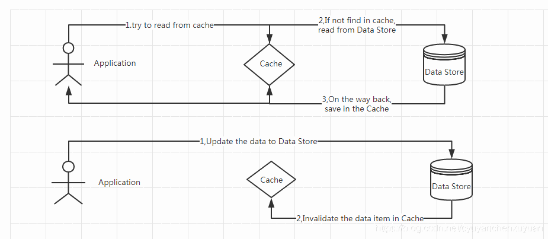

This post describes how to build a custom cache resolver in Spring. With a custom resolver, extra processing can be added to Spring's cache annotations.
The complete code is available in the example project [https://github.com/qihaiyan/springcamp/tree/main/spring-redis-resolver](https://github.com/qihaiyan/springcamp/tree/main/spring-redis-resolver).

## 1. Overview

The cache-aside pattern is a widely used caching pattern. The flow looks like this:



After the data in the database is updated, the cache is evicted, so subsequent reads get the latest data from the database, keeping the cached data consistent with the database data.

In Spring, caching is handled through cache annotations. Cache processing is usually encapsulated in the dao layer, so that the business layer doesn't need to be aware of the details of cache operations and can focus on business logic.

## 2. Reading and Evicting the Cache

Dao layer operations usually use Spring Data JPA, where the database methods are interfaces, and caching is implemented by adding the corresponding cache annotations to the interfaces.

Reading data:

```java
@Cacheable(value = "testCache", key = "#p0", unless = "#result == null")
Optional<DemoEntity> findById(Long id);
```

With the Cacheable annotation, after the data is read from the database it is also written to the cache at the same time.

Saving data:

```java
@CacheEvict(value = "testCache", key = "#p0.id")
DemoEntity save(DemoEntity entity);
```

With the CacheEvict annotation, the cache is evicted after the data is written to the database.
What if we want to perform other operations after the cache is evicted — for example, write the evicted cache key to Kafka so that other systems can delete their caches in sync? How should this be handled?

## 3. Custom Cache Resolver

Spring provides a way to define a custom cache resolver. With a custom resolver, extra operations can be added to the cache processing.

``` java
@Configuration
public class RedisCacheConfig extends CachingConfigurerSupport {

    @Bean
    public RedisCacheManager redisCacheManager(RedisConnectionFactory redisConnectionFactory) {

        RedisCacheConfiguration cacheConfiguration = RedisCacheConfiguration.defaultCacheConfig()
                .computePrefixWith(cacheName -> cacheName.concat(":"));

        return RedisCacheManager.builder(redisConnectionFactory)
                .cacheDefaults(cacheConfiguration)
                .build();

    }

    @Bean
    public CacheResolver customCacheResolver(RedisConnectionFactory redisConnectionFactory) {
        return new CustomCacheResolver(redisCacheManager(redisConnectionFactory));
    }
}
```

The code above is the Redis cache configuration. The ```RedisCacheManager``` part is the regular cacheManager configuration, while the ```customCacheResolver``` part is the custom resolver configuration. By declaring the customCacheResolver bean, we can reference this custom resolver in cache annotations.

Once the customCacheResolver bean is defined, we can reference it in cache annotations. The save method mentioned above, after the change, looks like this:

```java
@CacheEvict(value = "testCache", cacheResolver = "customCacheResolver", key = "#p0.id")
DemoEntity save(DemoEntity entity);
```

Compared with the previous implementation, the CacheEvict annotation now specifies a cacheResolver.

## 4. Implementing the Custom Resolver

Above we covered how to configure and reference a cacheResolver; below we look at the implementation of a custom cacheResolver.

``` java
public class CustomCacheResolver extends SimpleCacheResolver {

    public CustomCacheResolver(CacheManager cacheManager) {
        super(cacheManager);
    }

    @Override
    @NonNull
    public Collection<? extends Cache> resolveCaches(CacheOperationInvocationContext<?> context) {
        ParameterNameDiscoverer paramNameDiscoverer = new DefaultParameterNameDiscoverer();
        EvaluationContext evaluationContext = new MethodBasedEvaluationContext(context.getOperation(), context.getMethod(), context.getArgs(), paramNameDiscoverer);
        Expression exp = (new SpelExpressionParser()).parseExpression(((CacheEvictOperation) context.getOperation()).getKey());
        Collection<? extends Cache> caches = super.resolveCaches(context);
        context.getOperation().getCacheNames().forEach(cacheName -> {
            String key = cacheName + ':' + exp.getValue(evaluationContext, String.class);
            log.info("cache key={}", key);
        });
        return caches;
    }
}
```

The code above defines the CustomCacheResolver class, a custom resolver that extends SimpleCacheResolver. SimpleCacheResolver is the resolver Spring uses by default for cache annotations.
We extend the SimpleCacheResolver class to add extra operations. The ```resolveCaches``` method is where the cache operations are resolved.
In this part of the code, what we need is to obtain the value of the key of the cache being evicted in the ```@CacheEvict(value = "testCache", cacheResolver = "customCacheResolver", key = "#p0.id")``` annotation.
Through ```context.getOperation()).getKey()```, the key definition can be read from the context parameter, which is ```#p0.id```. This definition is a SpEL expression, but unlike an ordinary SpEL expression, p0 is a variable specific to JPA methods: it refers to the first parameter of the method, and likewise p1 refers to the second parameter. Ordinary SpEL processing cannot parse this expression.
Spring provides the ```MethodBasedEvaluationContext``` class for parsing this kind of special SpEL expression.

With the following four lines of code, we can obtain the actual key value:

```java
ParameterNameDiscoverer paramNameDiscoverer = new DefaultParameterNameDiscoverer();
EvaluationContext evaluationContext = new MethodBasedEvaluationContext(context.getOperation(), context.getMethod(), context.getArgs(), paramNameDiscoverer);
Expression exp = (new SpelExpressionParser()).parseExpression(((CacheEvictOperation) context.getOperation()).getKey());
String key = cacheName + ':' + exp.getValue(evaluationContext, String.class);
```

Once we have the key value, we can do a lot with it — for example, write the key to Kafka to notify other systems to clean up the same key.

## 5. Summary

We usually encapsulate cache operations in the dao layer to simplify the overall logic of the program. When Spring Data JPA is used as the dao layer implementation, the dao methods are all interfaces, and there is no way to attach extra operations to the cache annotations added on those interfaces.
When extra handling of cache operations is needed, it can be achieved with a custom resolver used in the cache annotations.
This way the overall logic of the program is not broken, and the cache operations are extended — a good implementation approach.
