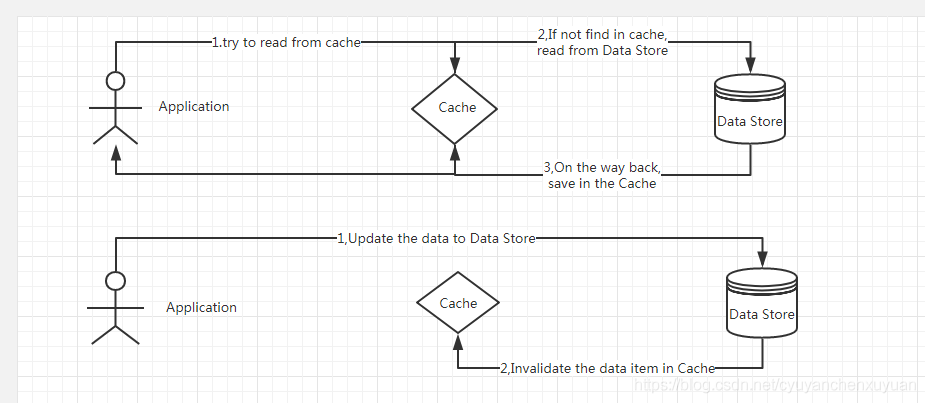

本文介绍spring中自定义缓存resolver，通过自定义resolver，可以在spring的cache注解中增加附加处理。
具体的代码参照 [示例项目 https://github.com/qihaiyan/springcamp/tree/main/spring-redis-resolver](https://github.com/qihaiyan/springcamp/tree/main/spring-redis-resolver)

## 一、概述

cache-aside模式是常用的缓存使用模式。使用流程如下图：



当更新数据库中的数据后，对缓存做失效处理，后续就能读取到数据库中最新的数据，使得缓存数据与数据库数据保持一致。

在spring中通过cache注解进行缓存的处理，一般会把缓存处理封装到dao层，这样业务层就不需要感知缓存操作的细节，可以专注于业务逻辑的处理。

## 二、缓存的读取和失效

dao层的操作通常使用springdatajpa，数据库方法都是一个interface，通过在interface上增加对应的cache注解实现缓存处理。

读取数据：

```java
@Cacheable(value = "testCache", key = "#p0", unless = "#result == null")
Optional<DemoEntity> findById(Long id);
```

通过Cacheable注解，从数据库中读取到数据后，会同步写到缓存中。

保存数据：

```java
@CacheEvict(value = "testCache", key = "#p0.id")
DemoEntity save(DemoEntity entity);
```

通过CacheEvict注解，在将数据写入到数据库后，对缓存进行失效。
如果我们想在缓存失效后，进行其它的操作，例如将失效缓存的key写入kafka，用于其它系统同步删除缓存，这时该怎样处理？

## 三、自定义缓存resolver

spring提供了自定义缓存resolver的方式，通过自定义resolver，可以在缓存处理中增加附加操作。

``` java
@Configuration
public class RedisCacheConfig extends CachingConfigurerSupport {

    @Bean
    public RedisCacheManager redisCacheManager(RedisConnectionFactory redisConnectionFactory) {

        RedisCacheConfiguration cacheConfiguration = RedisCacheConfiguration.defaultCacheConfig()
                .computePrefixWith(cacheName -> cacheName.concat(":"));

        return RedisCacheManager.builder(redisConnectionFactory)
                .cacheDefaults(cacheConfiguration)
                .build();

    }

    @Bean
    public CacheResolver customCacheResolver(RedisConnectionFactory redisConnectionFactory) {
        return new CustomCacheResolver(redisCacheManager(redisConnectionFactory));
    }
}
```

以上代码是redis缓存的配置，其中 ```RedisCacheManager``` 部分是常规的cacheManager的配置， 而  ```customCacheResolver``` 部分是自定义resolver的配置，通过定义customCacheResolver这个bean，可以在cache注解中引用到这个自定义的resolver。

定义好customCacheResolver的bean后，我们就可以在cache注解中引用，上面提到的数据保存方法改造后的代码：

```java
@CacheEvict(value = "testCache", cacheResolver = "customCacheResolver", key = "#p0.id")
DemoEntity save(DemoEntity entity);
```

相比于之前的实现，对CacheEvict增加指定cacheResolver。

## 四、自定义resolver的实现

上面我们介绍了如果配置和引用cacheResolver，下面介绍自定义cacheResolver的实现。

``` java
public class CustomCacheResolver extends SimpleCacheResolver {

    public CustomCacheResolver(CacheManager cacheManager) {
        super(cacheManager);
    }

    @Override
    @NonNull
    public Collection<? extends Cache> resolveCaches(CacheOperationInvocationContext<?> context) {
        ParameterNameDiscoverer paramNameDiscoverer = new DefaultParameterNameDiscoverer();
        EvaluationContext evaluationContext = new MethodBasedEvaluationContext(context.getOperation(), context.getMethod(), context.getArgs(), paramNameDiscoverer);
        Expression exp = (new SpelExpressionParser()).parseExpression(((CacheEvictOperation) context.getOperation()).getKey());
        Collection<? extends Cache> caches = super.resolveCaches(context);
        context.getOperation().getCacheNames().forEach(cacheName -> {
            String key = cacheName + ':' + exp.getValue(evaluationContext, String.class);
            log.info("cache key={}", key);
        });
        return caches;
    }
}
```

上面的代码定义了CustomCacheResolver这个自定义resolver类，继承SimpleCacheResolver。SimpleCacheResolver类是spring在cache注解中默认使用的resolver。
我们通过扩展SimpleCacheResolver这个类，来增加附加操作。其中```resolveCaches```就是解析缓存操作的部分。
在这部分代码中，我们需要的是获取到 ```@CacheEvict(value = "testCache", cacheResolver = "customCacheResolver", key = "#p0.id")``` 注解中失效的缓存的key的值。
通过 ```context.getOperation()).getKey()``` 从参数context中可以读取到key的定义，即 ```#p0.id``` ，这个定义是一个spel表达式，与普通的spel表达式不同， p0这个变量是jpa方法中的一个特有变量，表示方法中的第一个参数，同样p1表示方法中的第二个参数。通过普通的spel处理无法解析这个spel表达式。
spring提供了 ```MethodBasedEvaluationContext``` 类用于解析这种特殊的spel表达式。

通过一下四行代码，我们就能够获取到具体的key的值：

```java
ParameterNameDiscoverer paramNameDiscoverer = new DefaultParameterNameDiscoverer();
EvaluationContext evaluationContext = new MethodBasedEvaluationContext(context.getOperation(), context.getMethod(), context.getArgs(), paramNameDiscoverer);
Expression exp = (new SpelExpressionParser()).parseExpression(((CacheEvictOperation) context.getOperation()).getKey());
String key = cacheName + ':' + exp.getValue(evaluationContext, String.class);
```

获取到了key的值，我们就可以对这个key做很多操作，可以把这个key写入kafka，通知其它系统同步清理key。

## 五、总结

我们通常把缓存操作封装到dao层以简化程序的整体逻辑，当使用springdatajpa作为dao层的实现时，具体的dao方法都是interface，对于在interface上添加的cache注解，没有办法增加额外的其它操作。
当需要对缓存操作做额外处理时，可以通过自定义resolver的方式实现，在cache注解中使用我们自定义的resolver。
这样既没有破环程序的整理逻辑，又扩展了对缓存的操作，是一种比较好的实现方式。
