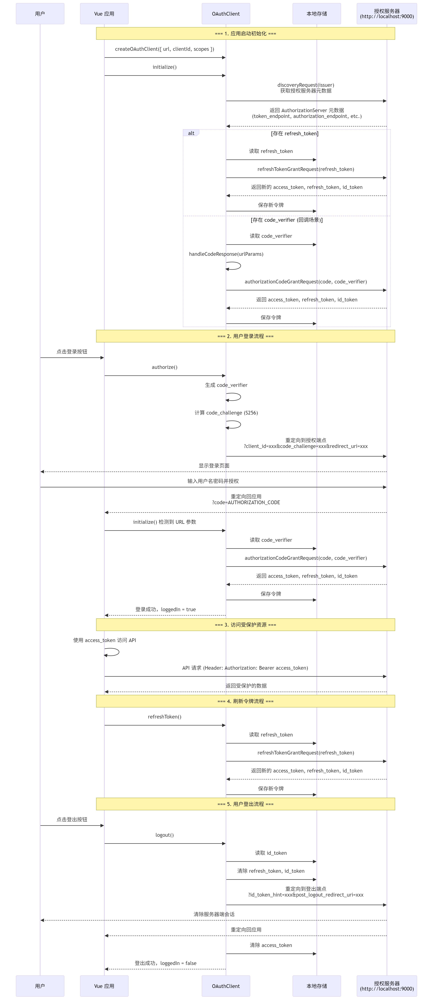

通过Spring Authorization Server对vue应用进行授权防护。 

[示例项目 https://github.com/qihaiyan/ng-boot-oauth](https://github.com/qihaiyan/ng-boot-oauth)

 

 运行该示例代码时，要先启动 `authserver`，再启动 `ui-spa-vue`。

## 一、概述

vue对接oauth进行认证防护的介绍已经很多了，但是跟Spring Authorization Server集成的示例比较少，并且很多还都是vue2的代码，本文主要是介绍vue3跟Spring Authorization Server集成的方法和示例。

## 二、核心交互流程

这个流程图展示了完整的 OAuth 2.0 + OpenID Connect 授权码流程，包括应用初始化、用户登录、令牌管理和登出等关键步骤。

 

### 1. 初始化流程 (main.ts:17)
- 创建 OAuthClient 实例并配置参数
- 调用 initialize() 执行服务发现
- 自动处理令牌刷新或授权码回调
### 2. 授权码流程 (OAuthClient.ts:240)
- 使用 PKCE (Proof Key for Code Exchange) 增强安全性
- 生成 code_verifier 和 code_challenge
- 重定向到授权服务器获取授权码
- 使用授权码换取访问令牌
### 3. 令牌存储 (OAuthClient.ts:130-145)
- access_token : 访问受保护资源的令牌
- refresh_token : 用于刷新访问令牌
- id_token : OpenID Connect 身份令牌
- code_verifier : PKCE 验证码
### 4. 登出流程 (OAuthClient.ts:369)
- 清除本地存储的令牌
- 使用 id_token_hint 参数通知授权服务器
- 重定向到授权服务器的登出端点
### 5. 安全特性
- ✅ PKCE (S256) 防止授权码拦截攻击
- ✅ HTTPS 限制（开发环境可通过 allowInsecureRequests 绕过）
- ✅ 令牌自动刷新机制
- ✅ 本地存储持久化

## 三、vue端的核心配置

``` javascript
const authClient = createOAuthClient({
    url: 'http://localhost:9000',
    clientId: 'public-client',
    scopes: 'openid profile',
})
```

在main.ts中初始化`authClient`，提供三个核心参数：
1. url: 认证服务的根路径url，authClient会通过该根路径调用认证服务的相关接口，比如会首先调用`http://localhost:9000/.well-known/openid-configuration`接口来获取认证服务的完整接口列表。
2. clientId: 认证服务设置的clientId，便于演示方便，authserver中写死了几个client，其中`public-client`是用于对vue程序提供认证服务的client。
3. scopes: 用户数据范围，这个范围列表也是在`authserver`中写死的。

## 四、authserver端的核心配置

authserver端使用了Spring的Authorization Server，该框架提供的完整的oauth2认证服务功能，不过是一个开发库，不是开箱即用的服务，需要自己编写服务集成这个库。文档只介绍比较关键的client的配置，其它完整配置可以看示例代码。

``` java
RegisteredClient publicClient = RegisteredClient.withId(UUID.randomUUID().toString())
                .clientId("public-client")
                .clientAuthenticationMethod(ClientAuthenticationMethod.NONE)
                .authorizationGrantType(AuthorizationGrantType.AUTHORIZATION_CODE)
                .scope(OidcScopes.OPENID)
                .scope(OidcScopes.PROFILE)
                .clientSettings(ClientSettings.builder()
                        .requireAuthorizationConsent(true)
                        .requireProofKey(true)
                        .build()
                )
                .redirectUris((uris) -> uris.addAll(Set.of(
                        "http://127.0.0.1:4200",
                        "http://localhost:4200",
                        "http://localhost:5173"
                        ))
                )
                .postLogoutRedirectUris((uris) -> uris.addAll(Set.of(
                        "http://127.0.0.1:4200",
                        "http://localhost:4200",
                        "http://localhost:5173"
                )))
                .build();
```

以上代码是注册了一个`client`，指定了`scope`，其中的`clientId: public-client`就是前面介绍vue认证配置代码中提到的clientId，这两个id必须一致，否则authserver会报非法client的错误。

同时还设置了登录成功重定向url，登出重定向url。这些参数都是oauth2认证流程的关键参数。
